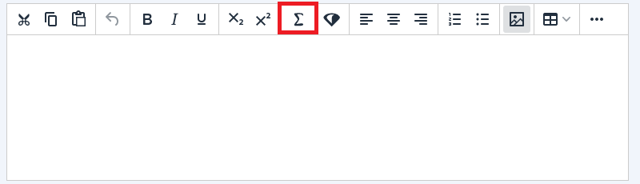
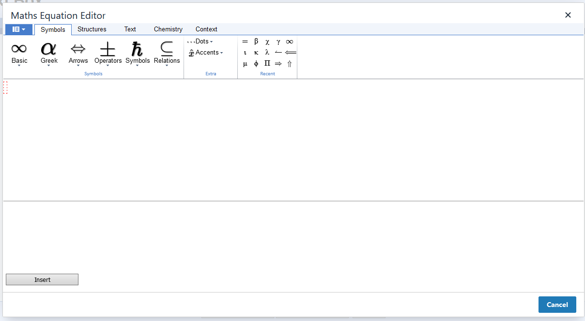
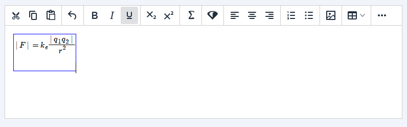

# mathsEquationEditor TinyMCE Plugin

This is a repo containing the mathsEquationEditor TinyMCE plugin.

Developed at the University of Nottingham

Contributors:

* Dr Joseph Baxter
* Adam Clarke

# Deploy instructions

Run ```yarn build``` to creat dist directory

Copy dist/maths-equation-editor to the desired location

See documentation about loading external plugins at [https://www.tiny.cloud/docs/configure/integration-and-setup/#external_plugins](https://www.tiny.cloud/docs/configure/integration-and-setup/#external_plugins)

# Functionality

Adds a maths equation editor button to the toolbar



This launches a dialog where you enter math forumula



Which is insert into the edtir contents



